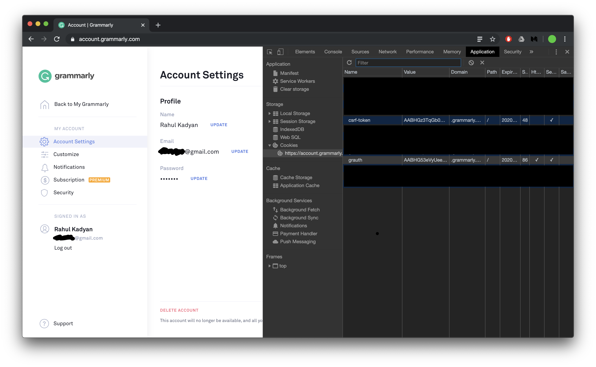

# Grammarly

Unofficial Grammarly extension.

## Features

- Issue highlighting with hover description.
- Replacement suggestions.
- Checks plaintext and markdown.

## Requirements

You can use your premium account by providing personal AuthTokens. Your own personal AuthTokens can be found by inspecting the [https://app.grammarly.com/](https://app.grammarly.com/) and looking at the Cookies tab.

Copy `csrf-token` and `grauth` cookies and set extension settings.

## Extension Settings

This extension contributes the following settings:

- `grammarly.auth.grauth`: `grauth` cookie value
- `grammarly.auth.csrf-token`: `csrf-token` cookie value

## Release Notes

### Version 0.0.1

Initial release of unofficial Grammarly extension.

**Enjoy!**
