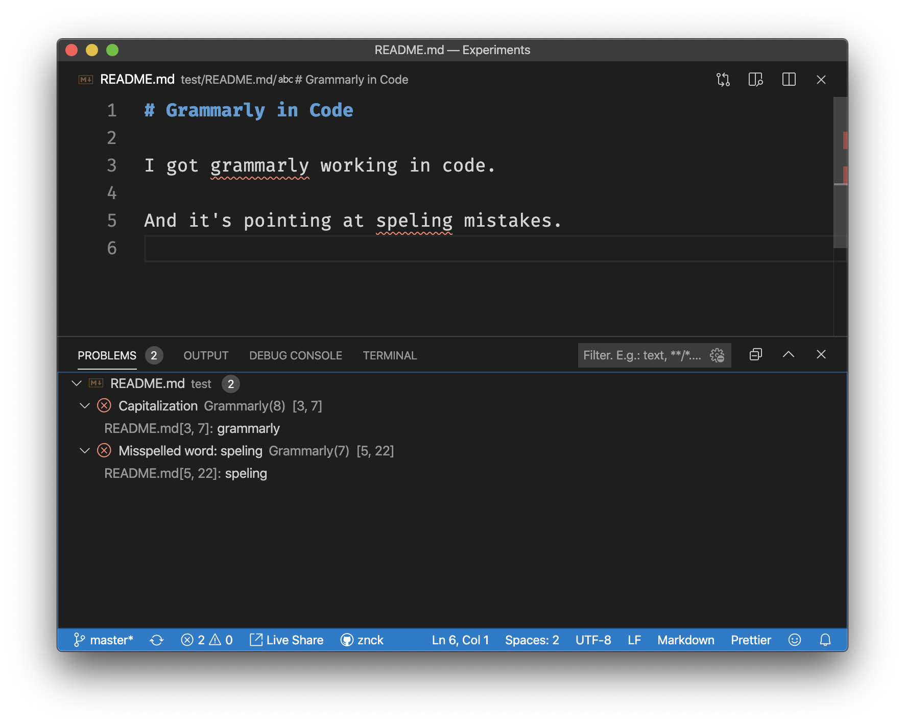
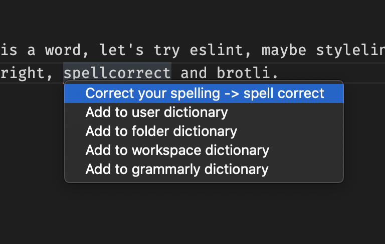

# Grammarly

Unofficial Grammarly extension.

## Features

- Issue highlighting with hover description.
- Replacement and synonym suggestions.
- Checks plaintext and markdown.

## Extension Settings

This extension contributes to the following settings:

- `grammarly.username`: Grammarly username
- `grammarly.password`: Grammarly password
- `grammarly.dialect`: The dialect of English language (default `american`, available options are `american` and `british`)
- `grammarly.userWords`: User words to add to dictionary.

## Release Notes

### Version 0.3.0

Save words to local or grammarly dictionary.

### Version 0.1.0

Uses incremental document sync to send operational transformation messages to Grammarly API which
gives near real-time feedback/diagnostics.

### Version 0.0.0

Initial release of unofficial Grammarly extension.

**Enjoy!**
