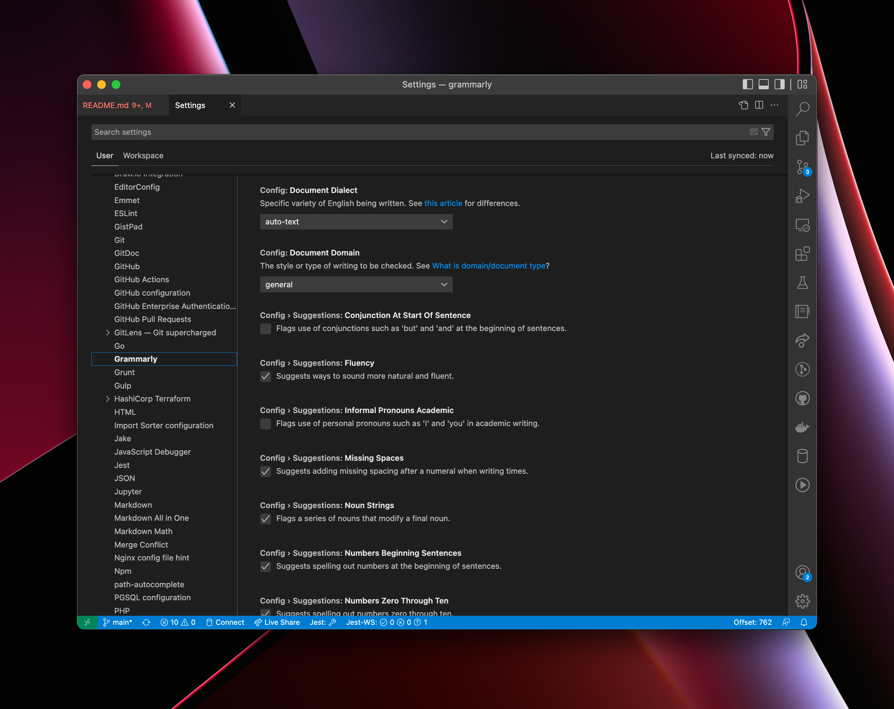
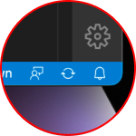
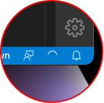
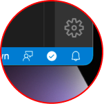
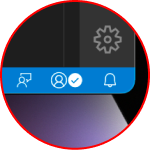
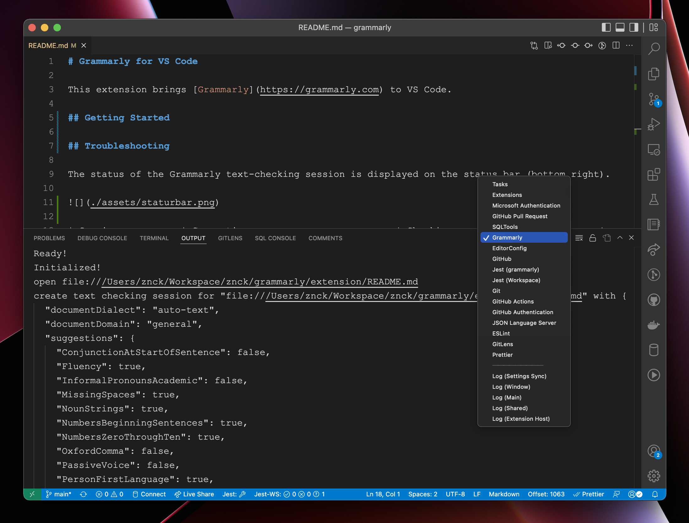

# Grammarly for VS Code

This extension brings [Grammarly](https://grammarly.com) to VS Code.

## Getting Started

You need to configure which files should be checked with Grammarly.

- Set `grammarly.files.include` or **Grammarly > Files > Include** to the allowed list of files.
- Run `grammarly.check` or **Grammarly: Check text** command

Default configuration:

```json
{
  "grammarly.files.include": ["**/README.md", "**/readme.md", "**/*.txt"]
}
```

You may use `grammarly.files.exclude` to ignore specific files.

## Grammarly account or premium

Run `grammarly.login` or **Grammarly: Login / Connect your account** command to connect your Grammarly account.
Run `grammarly.logout` or **Grammarly: Log out** to disconnect your account.

## Configuration

Configure dialect, document domain, and which check to include in settings.



## Supported Languages

- plaintext
- markdown (work in progress) — [CommonMark](https://commonmark.org/)
- html (work in progress)
- Many more you can enable by opening Grammarly > Files > Include in settings:


## Troubleshooting

The status of the Grammarly text-checking session is displayed on the status bar (bottom right). Clicking on the status bar icon would pause/resume text checking session.


| Session           | Connecting                          | Checking                          | Done                               | Paused                          | Error                          |
| ----------------- | ----------------------------------- | --------------------------------- | ---------------------------------- | ------------------------------- | ------------------------------ |
| Anonymous         |  |  |       |  |  |
| Grammarly Account |  |  |  |  |  |

Check output panel for logs.



Run `grammarly.restart` or **Grammarly: Restart language server** to restart the text checking service.

## How to get help

Have a question, or want to provide feedback? Use [repository discussions](https://github.com/znck/grammarly/discussions) to ask questions, share bugs or feedback, or chat with other users.

## Support

This extension is maintained by [Rahul Kadyan](https://github.com/znck). You can [💖 sponsor him](https://github.com/sponsors/znck) for the continued development of this extension.

<p align="center">
  <a href="https://cdn.jsdelivr.net/gh/znck/sponsors@main/sponsors.svg">
    
  </a>
</p>

<br>
<br>
<br>
